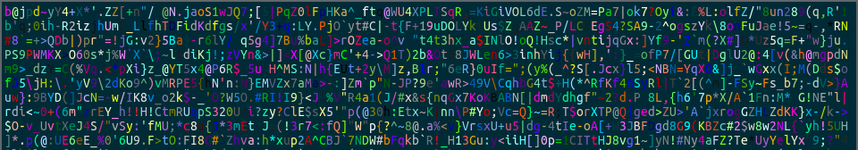

# terminfo

A terminfo library for Go

## Example

go run [_example/random.go](_example/random.go)

## References

- [ANSI escape code][l1]
- [term(5)][l2]
- [terminfo(5)][l3]
- [ncurses source code][l4]

<!-- references -->

[l1]: https://en.wikipedia.org/wiki/ANSI_escape_code
[l2]: https://invisible-island.net/ncurses/man/term.5.html
[l3]: https://invisible-island.net/ncurses/man/terminfo.5.html
[l4]: https://invisible-island.net/datafiles/current/ncurses.tar.gz